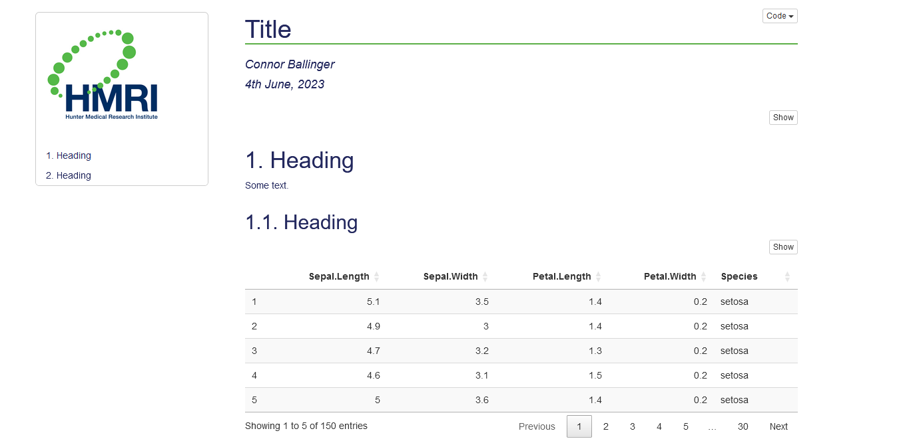

<!-- README.md is generated from README.Rmd. Please edit that file -->

```{r, include = FALSE}
knitr::opts_chunk$set(
  collapse = TRUE,
  comment = "#>",
  fig.path = "man/figures/README-",
  out.width = "100%"
)
```

# Helping with Health Economics

<!-- badges: start -->
<!-- badges: end -->

conr is a package to provide templates and convenience functions for work in 
health economics.
It is my first package and will be bug-ridden.

## Templates

A project template exists. 
It provides a folder structure and facilitates `Git` and `renv` integration (all
of which are optional).

There is an Rmarkdown template to produce an .html document (current or old HMRI 
branding), example below, and another to produce a Word document (.docx).



## Functions

All function files (see their code in R/):

```{r, echo=FALSE}
list.files("./R/")
```

## Installation

You can install the development version of conr from 
[GitHub](https://github.com/) with:

``` r
# install.packages("devtools")
devtools::install_github("connor-ballinger/conr")
```

## Ideas to Add

-   Functions to fix/improve:

    - remove print_rgrsn

-   New functions:

    -   check lubridate and testthat and tools dependencies
    -   init_project: try setting active project in addition to directory for
    console output.
    -   functions for decision modelling
    -   create labels and data dictionary
    -   2SB with shrinkage correction (NG 2013)
    -   mean & quantiles (for bootstrap output, multiple variables)
    -   wrappers to simplify use of gtsummary
    -   style all sorts of tables

-   Another template - pdf or shiny or a multi-page html.

- Use @describeIn or @rdname? https://roxygen2.r-lib.org/articles/reuse.html

- utils::menu or base::readline?

- Make data less available? No, causes issues, perhaps simpler to leave.

     - datasets will either be automatically exported if you set LazyData: true in your DESCRIPTION, or made available after calling data() if not. https://roxygen2.r-lib.org/articles/namespace.html

## Testing

- I haven't implemented tests thus far. Most of the functions in `conr` relate to files/directories or non-interactive functions (executed when knitting .Rmd). Such tests seem complicated - see tests for usethis::create_package() or workflowr::wflow_start().

## Package Overview

```{r}
fs::dir_tree()
```

