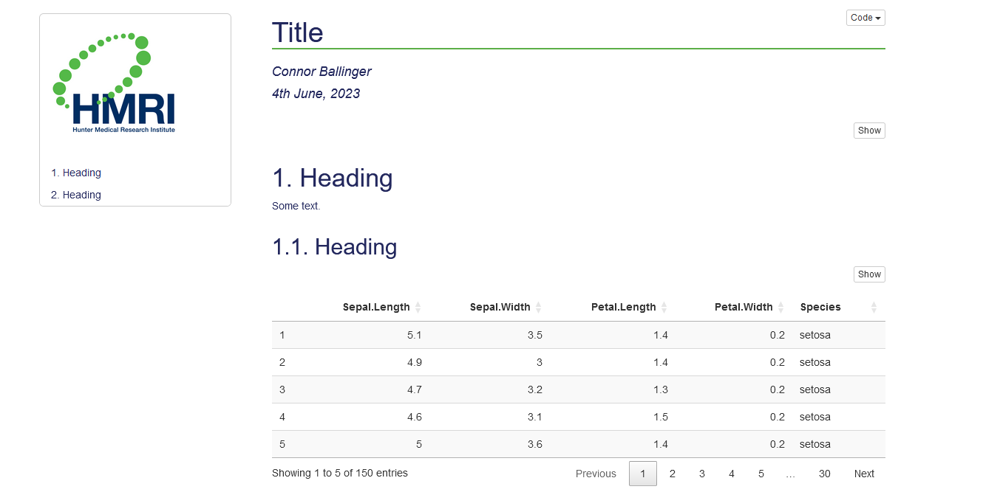

<!-- README.md is generated from README.Rmd. Please edit that file -->

# conr: Helping with Health Economics

<!-- badges: start -->
<!-- badges: end -->

conr is a package to provide templates and convenience functions for
work in health economics. It is my first package and will be bug-ridden.

## Templates

To this point, there is an Rmarkdown template to produce an html
document, example below.



## Functions

Random bits of code that may be useful.

All functions (see their code in R/):

    #>  [1] "adorn_df.R"                      "bootstrap_basic.R"              
    #>  [3] "bootstrap_cluster.R"             "bootstrap_two_stage_shrinkage.R"
    #>  [5] "calc_ind_qaly.R"                 "calc_qaly.R"                    
    #>  [7] "data.R"                          "decode_text.R"                  
    #>  [9] "fix_excel_cols.R"                "format_date.R"                  
    #> [11] "format_html.R"                   "knit_df.R"                      
    #> [13] "plot_icer.R"                     "print_regrsn.R"                 
    #> [15] "round_sensibly.R"                "write_and_date.R"

## Installation

You can install the development version of conr from
[GitHub](https://github.com/) with:

``` r
# install.packages("devtools")
devtools::install_github("connor-ballinger/conr")
```

## Ideas to Add

- Functions to fix/improve:

  - plot_icer

- New functions:

  - functions for decision modelling
  - create labels and data dictionary
  - basic bootstrap
  - 2SB with shrinkage correction (NG 2013)
  - mean & quantiles (for bootstrap output, multiple variables)

- Another template - word or pdf or shiny or a multi-page html.
