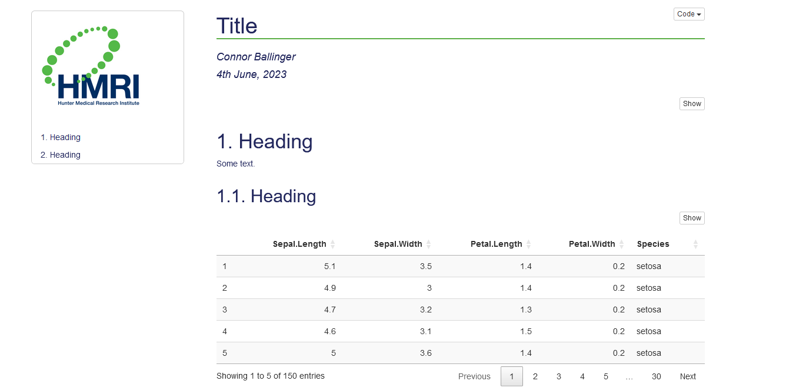

<!-- README.md is generated from README.Rmd. Please edit that file -->

# conr: Helping with Health Economics

<!-- badges: start -->
<!-- badges: end -->

conr is a package to provide templates and convenience functions for
work in health economics. It is my first package and will be bug-ridden.

## Templates

To this point, there is an Rmarkdown template to produce an html
document, example below.



## Functions

There is no common theme for the functions, they are random bits of code
that may be useful.

All functions (see their code in R/):

    #>  [1] "adorn_df.R"              "calc_ind_qaly.R"        
    #>  [3] "calc_qaly.R"             "decode_text.R"          
    #>  [5] "fix_excel_cols.R"        "format_date.R"          
    #>  [7] "format_html.R"           "knit_print.data.frame.R"
    #>  [9] "plot_icer.R"             "print_regrsn.R"         
    #> [11] "round_sensibly.R"        "write_and_date.R"

The following functions are only to be used in rendering an Rmd
document:

- [format_html](./R/format_html.R)

- [knit_print.data.frame](./R/knit_print.data.frame.R) which changed to
  a method (no longer an exported function) possibly after R 4.3.1 or
  maybe an update to devtools or similar package.

- [write_and_date](./R/write_and_date.R)

## Installation

You can install the development version of conr from
[GitHub](https://github.com/) with:

``` r
# install.packages("devtools")
devtools::install_github("connor-ballinger/conr")
```

## Ideas to Add

- Functions to fix/improve:

  - 

- New functions:

  - functions for decision modelling
  - create labels and data dictionary
  - basic bootstrap
  - 2SB with shrinkage correction (NG 2013)
  - 

- Another template - word or pdf or shiny or a multi-page html.
